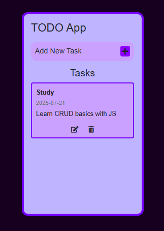
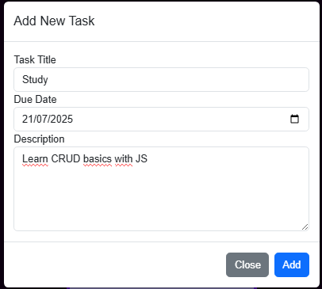

# TODO-LIST

## Descrição 📋
Aplicação de uma TODO-LIST para praticar conceitos básicos de CRUD em JS. conta com gerenciamento de tarefas, permitindo que os usuários adicionem, visualizem e gerenciem suas tarefas diárias. 

Link da Aplicação: https://todo-list74.vercel.app

## Funcionalidades 
- ➕ Criar tarefas com:
  - Título (obrigatório)
  - Data de vencimento (opcional)
  - Descrição detalhada (opcional)
- ❌ Excluir e ✏️ Editar sua tarefas já existentes
## Tecnologias Utilizadas 
| Tecnologia | Função |
|------------|--------|
| HTML | Estrutura da página|
| CSS | Estilização|
| JavaScript | Lógica e interatividade |
| Bootstrap 5 | Componentes UI|

## Como Usar 
1. Clique em **"Add New Task"**
2. Preencha os campos:
   - Título (obrigatório)
   - Data (opcional)
   - Descrição (opcional)
3. Clique em **"Add"** para salvar
4. Visualize suas tarefas na lista principal

## Estrutura do Projeto 📂
todo-app/  
├── index.html   
├── style.css   
└── main.js 

# Home Page

# Formulário para Criação de Tarefas

